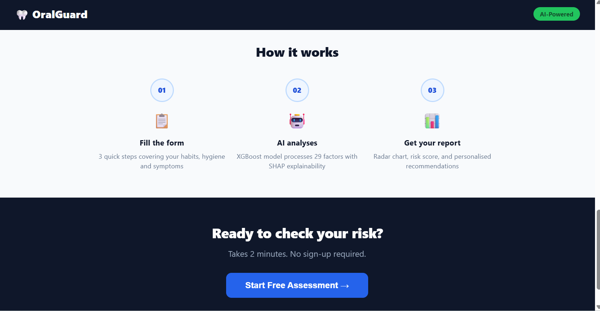
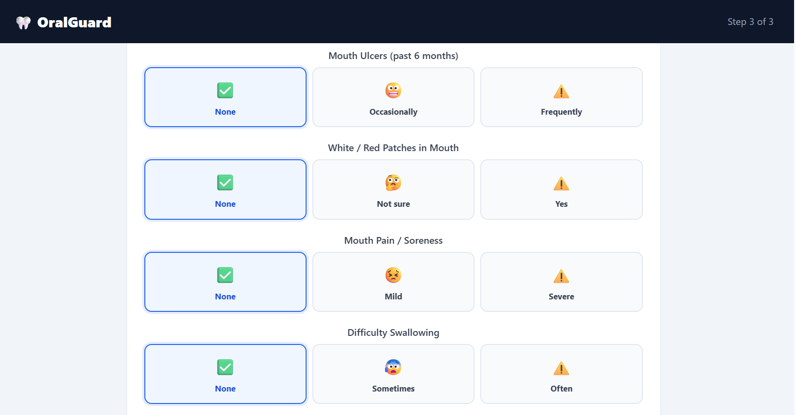
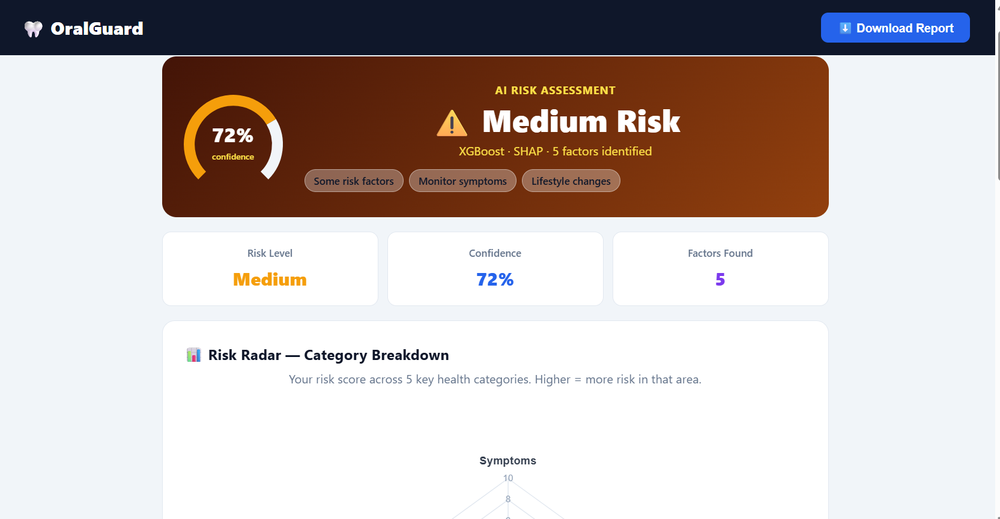
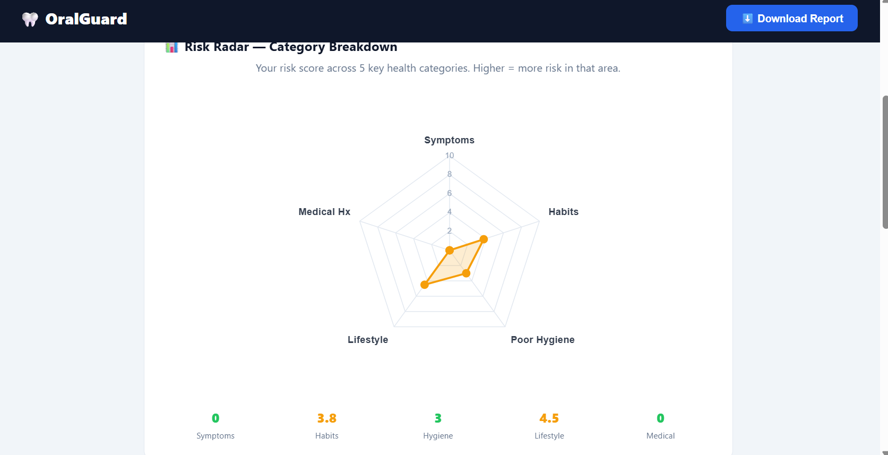
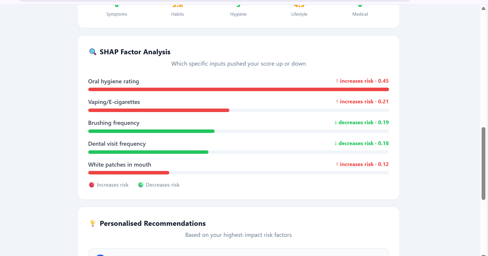

# 🦷 OralGuard — AI Oral Cancer Risk Assessment

> AI-powered oral cancer risk assessment for Gen Z — built on primary survey data, XGBoost + SHAP, and deployed full-stack.

---

## 1. Project Overview

OralGuard predicts oral cancer risk (**Low / Medium / High**) from a 2-minute lifestyle and symptom assessment. Built on **primary survey responses** from Indian college students, augmented to 1,500 rows for training. Features SHAP explainability, a radar chart risk breakdown, personalised recommendations, and a downloadable PDF report.

---

## 2. Demo Links

| | Link |
|---|---|
| 🌐 Live App | [oral-guard-ai-657b.vercel.app](https://oral-guard-ai-657b.vercel.app) |
| ⚙️ API Docs | [oralguard-api.onrender.com/docs](https://oralguard-api.onrender.com/docs) |
| 📁 GitHub | [github.com/TechByPareek/OralGuardAI](https://github.com/TechByPareek/OralGuardAI) |

> **Note:** Backend is on Render free tier — first request after inactivity takes ~30 seconds to wake up.

---

## 3. Features

-  **3-step assessment form** — 29 fields covering habits, hygiene, symptoms, medical history
-  **XGBoost model** — trained with Optuna tuning, 91.9% F1-score
-  **SHAP explainability** — shows exactly which factors drive each prediction
-  **Radar chart** — risk breakdown across 5 health categories (Chart.js)
-  **PDF report** — downloadable 2-page report with charts and recommendations
-  **Privacy-first** — no user data stored, no accounts required
-  **Mobile responsive** — works on all screen sizes

---

## 4. Tech Stack

| Layer | Tech |
|---|---|
| ML Model | XGBoost + Optuna + SHAP + SMOTE |
| Backend | FastAPI + Pydantic + joblib |
| Frontend | React.js + Vite + Chart.js + jsPDF |
| Database | None (stateless API) |
| Deployment | Render (backend) + Vercel (frontend) |

---

## 5. Architecture

```
User fills form (React · Vercel)
        ↓  POST /predict
FastAPI validates input (Pydantic)
        ↓
preprocessor.pkl → encode + scale 29 features
        ↓
xgb_model.pkl → Low / Medium / High + probability
        ↓
SHAP TreeExplainer → top 5 risk factors
        ↓
Recommendations engine → 3 personalised tips
        ↓
JSON response → React renders results
        ↓
Radar chart + SHAP bars + PDF download
```

---

## 6. Model Performance

| Model | Accuracy | F1 | ROC-AUC |
|---|---|---|---|
| Logistic Regression | 0.98 | 0.98 | 1.00 |
| SVM | 0.95 | 0.95 | 1.00 |
| Random Forest | 0.88 | 0.88 | 0.97 |
| **XGBoost (tuned) ✓** | **0.92** | **0.92** | **0.98** |

XGBoost selected over Logistic Regression for SHAP compatibility and better generalisation on augmented data.

---

## 7. Local Setup

```bash
# Clone
git clone https://github.com/TechByPareek/OralGuardAI.git
cd OralGuardAI

# Backend
pip install -r requirements.txt
uvicorn api.main:app --reload --port 8000

# Frontend (new terminal)
cd frontend
npm install
npm run dev
```

Create `frontend/.env`:
```
VITE_API_URL=http://localhost:8000
```

---

## 8. Screenshots

| Home | Form | Result 1 | Result 2 | Result 3 |
|------|------|----------|----------|----------|
|  |  |  |  |  |
---

## 9. Limitations

- Dataset comprises 68 real survey responses augmented synthetically to 1,500 rows — high accuracy reflects augmented patterns, not clinical validation
- Self-reported data may underrepresent habits like smoking or gutka use
- India-specific model — trained on Gen Z Indian college student data
- Render free tier causes ~30s cold start delay after inactivity

---

## 10. Author

**Janhvi Pareek** — B.Tech (4th Year)  
 GitHub: [@TechByPareek](https://github.com/TechByPareek)
LeetCode: (https://leetcode.com/u/Janhvi_pareek/)

> ⚠️ **Disclaimer:** OralGuard is for awareness only and does not constitute medical diagnosis. Always consult a qualified dental professional.